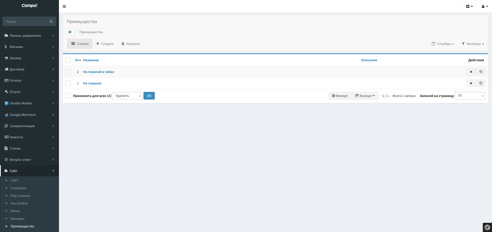
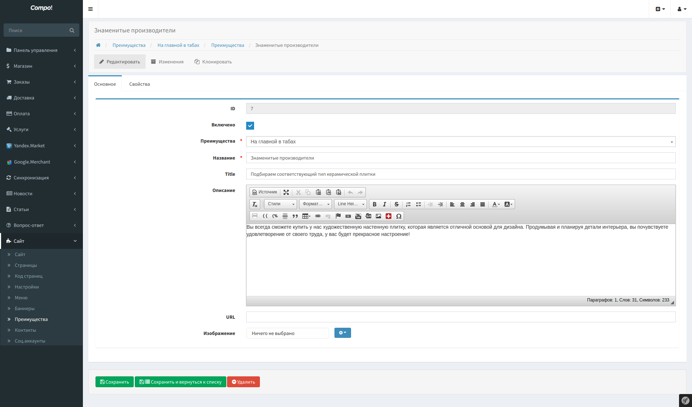
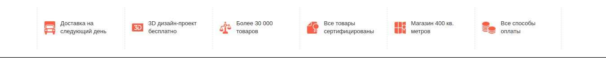
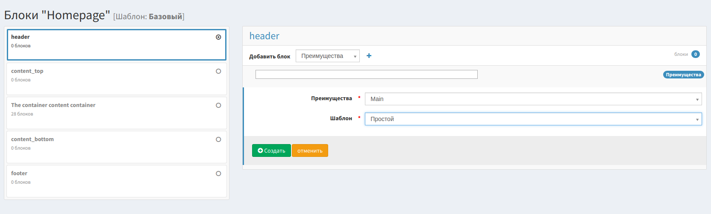

Advantages - Приемущества
==========================

Позволяет создавать списки приемуществ, для краткой информации о особенностях, сервисах магазина или другой полезной для покупателя информации.

Размещать на страницах сайта, в модальных окнах, уведомлениях и письмах.

Возможность вывода в различных шаблонах.

Можно использовать изображения, иконки.

Отображаются только включённые элементы списка приемуществ.

Возможна сортировка элементов по позиции.

Панель управления
-------------------

* Список

* Редактирование

Блоки
-------------------

.. code-block:: bash

    {{ sonata_block_render({
        'type': 'compo_advantages.block.service.advantages',
        'settings': {
            'id': 123,
            'template': 'CompoAdvantagesBundle:Block:advantages.html.twig'
        }
    }) }}

Шаблоны
-------------------

.. code-block:: yaml

    sonata_block:
        blocks:
            compo_advantages.block.service.advantages:
                cache: sonata.cache.memcached
                contexts: [sonata_page_bundle]
                templates:
                    - { name: 'advantages.template.simple', template: 'CompoAdvantagesBundle:Block:advantages_simple.html.twig' }
