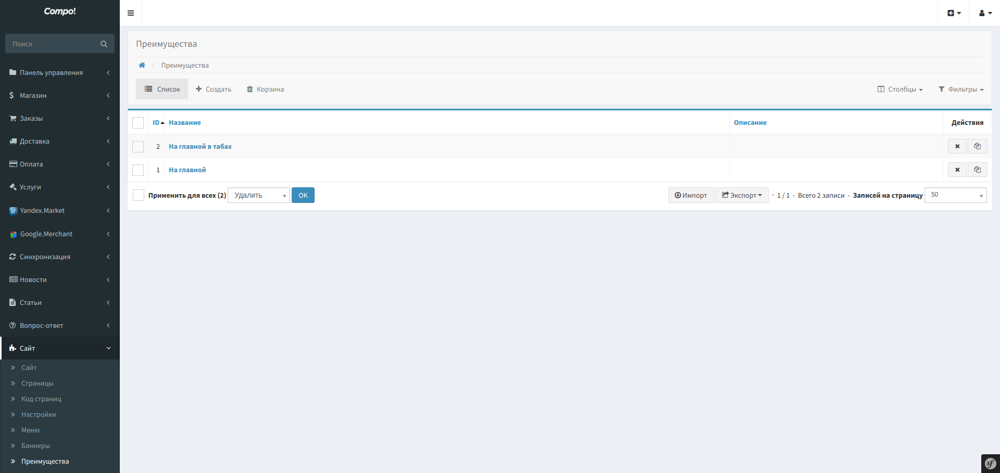
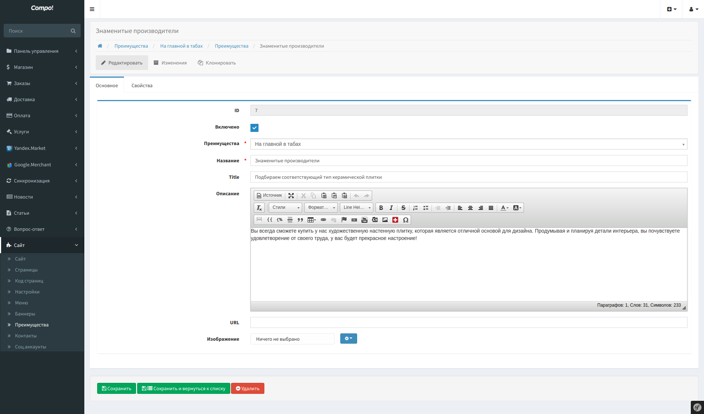

Advantages
============

Преимущества с группировкой по спискам.
Элемент списка преимуществ, имеет следующие поля:

* Название
* Title
* Описание
* URL
* Изображение

В зависимости от шаблона, использование полей опционально.

Install
-------------------

* Add CompoAdvantagesBundle to your AppKernel:

.. code-block:: php

    <?php

    // app/AppKernel.php

    // ...
    public function registerBundles()
    {
        return array(
            // ...
            new \Compo\AdvantagesBundle\CompoAdvantagesBundle(),
            // ...
        );
    }

* Add compo_advantages.admin.advantages to sonata_admin:

.. code-block:: yaml

    sonata_admin:
        dashboard:
            groups:
                sonata.admin.group.site_builder:
                    label:           site
                    label_catalogue: CompoCoreBundle
                    icon:            '<i class="fa fa-puzzle-piece"></i>'
                    items:
                        - compo_advantages.admin.advantages

* Update database schema by running command ``php app/console doctrine:schema:update --force``

Admin
-------------------

* List

* Edit

Block
-------------------

.. code-block:: bash

    {{ sonata_block_render({
        'type': 'compo_advantages.block.service.advantages',
        'settings': {
            'id': 134
        }
    }) }}

