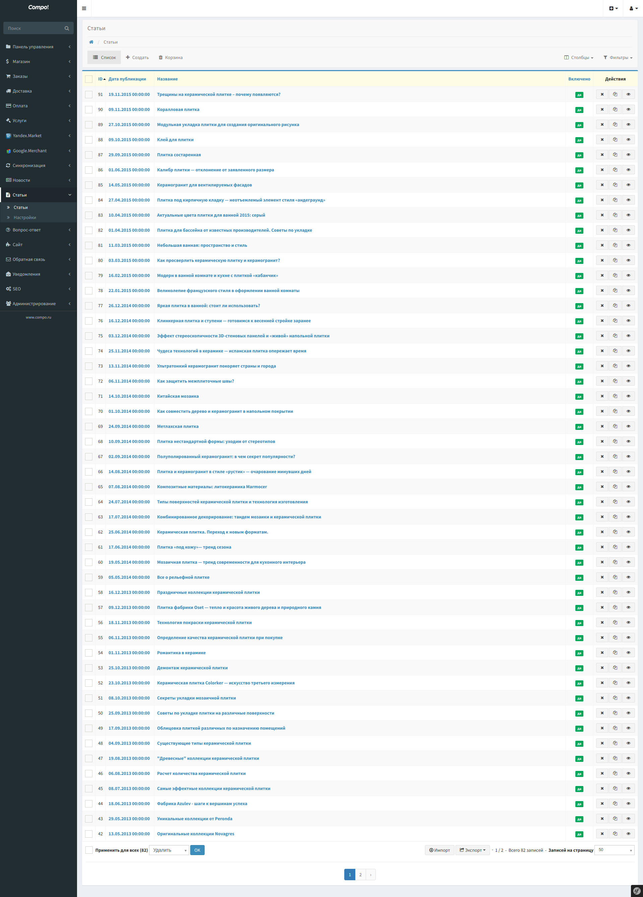
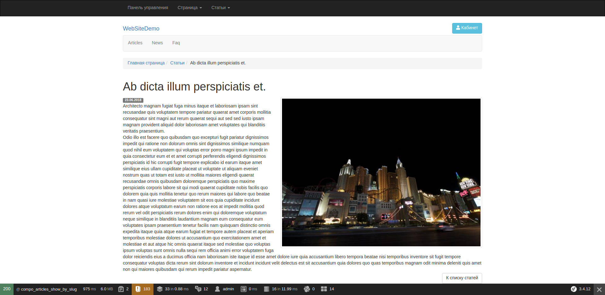

Articles - Статьи
=================

"Статьи" предназначены для управления сайте различными информационными материалами.

Статьи могут содержать произвольный текст, картинки, ссылки, таблицы, видео и другие объекты.

Для более удобной работы со статьями используется встроенный визуальный редактор, который позволяет с легкостью, как и в MS Word, редактировать содержимое статьи.

Статья, имеет следующие поля:

* Включить/Выключить
* Название
* Описание
* Текст
* Кол-во просмотров
* Дата публикации
* Изображение
* Seo настройки

На сайте выводятся список статей с постраничной навигацией.

Отображаются только включённые статьи и с датой публикации меньше текущей даты.

Имеется блок, для отображения последних опубликованных статей.

Панель управления
-------------------

* Список

По умолчанию отсортировано по дате публикации, по убыванию.

* Редактирование

Блоки
-------------------

.. code-block:: twig

    {{ sonata_block_render({
        'type': 'compo_articles.block.service.articles_last',
        'settings': {
            'limit': 5
            'template': 'CompoArticlesBundle:Block:articles_last.html.twig'
        }
    }) }}

.. figure:: ../images/articles/block.png
    :align: center

.. figure:: ../images/articles/block_edit.png
    :align: center

Permalink
-------------------

#TODO

Controller
-------------------

.. code-block:: yaml

    compo_articles_index:
        path:     /articles/
        defaults: { _controller: "CompoArticlesBundle:Articles:index" }
        methods:  GET

.. code-block:: yaml

    compo_articles_show_by_slug:
        path:     /articles/{slug}.html
        defaults: { _controller: "CompoArticlesBundle:Articles:showBySlug" }
        methods:  GET

AdminNavBar
-------------------

При просмотре на сайте списка статей или статьи, доступна панель администратора, для быстрого доступа к редактированию.

Breadcrumb
-------------------

Генерация хлебных крошек из названия статьи.

Settings
-------------------

Кол-во статей на страницу при постраничной навигации на сайте.

Sitemaps
-------------------

Генерация Sitemaps со списком статей раз в сутки.

Templates
-------------------

* Articles/index.html.twig
* Articles/show.html.twig
* Block/articles_last.html.twig

.. code-block:: yaml

    sonata_block:
        blocks:
            compo_articles.block.service.articles_last:
                cache: sonata.cache.memcached
                contexts: [sonata_page_bundle]
                templates:
                    - { name: 'articles.template.articles_last.custom', template: 'CompoArticlesBundle:Block:articles_last_custom.html.twig' }

Seo
-------------------

* URL
* Заголовок
* Title
* Description
* Keywords
