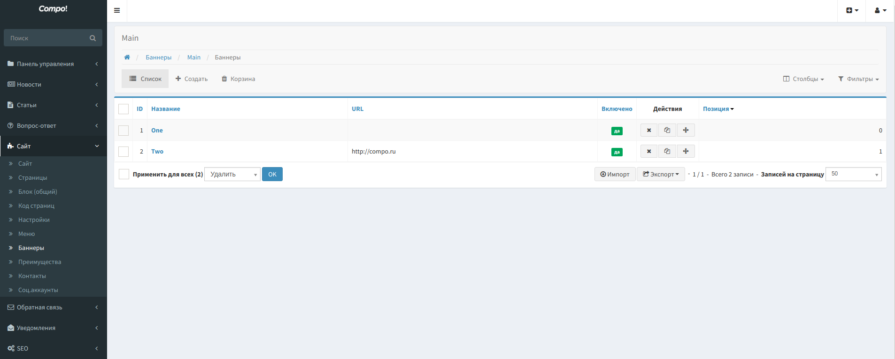
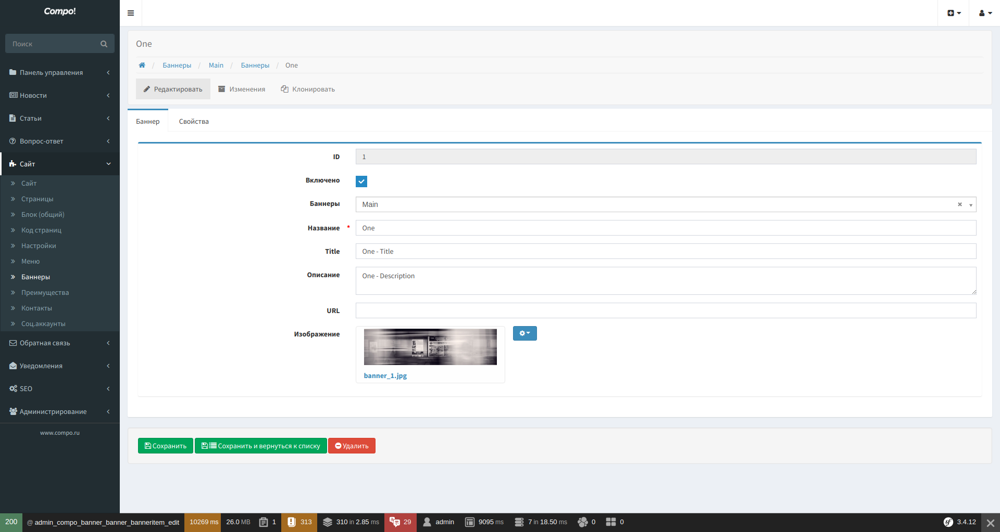
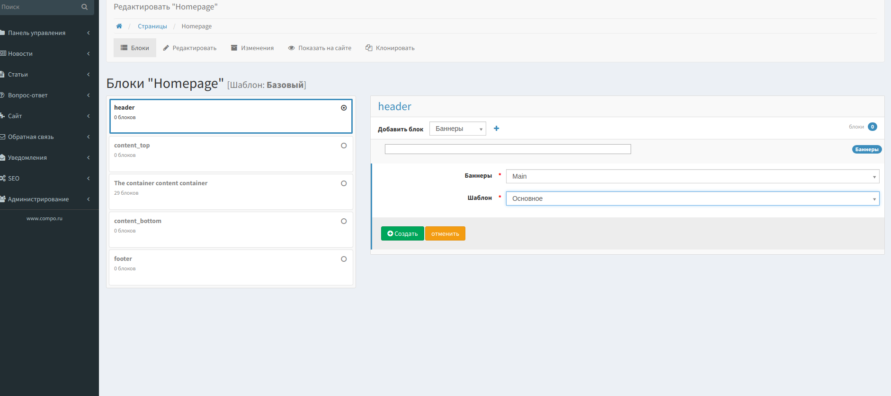

Banner - Баннеры
=================

Модуль управляет показом на страницах сайта рекламных и информационных блоков (баннеров) любого формата.

Отображаются только включённые элементы списка баннеров.

Возможна сортировка элементов по позиции.

По умолчанию, для отображения баннеров используется JavaScript библитека: http://kenwheeler.github.io/slick/

Панель управления
-------------------

* Список

По умолчанию отсортировано по дате публикации, по убыванию.

* Редактирование

Блоки
-------------------

.. code-block:: twig

    {{ sonata_block_render({
        'type': 'compo_banner.block.service.banner',
        'settings': {
            'id': 5,
            'template': 'CompoBannerBundle:Block:slider.html.twig'
        }
    }) }}

Шаблоны
-------------------

.. code-block:: yaml

    sonata_block:
        blocks:
            compo_banner.block.service.banner:
                cache: sonata.cache.memcached
                contexts: [sonata_page_bundle]
                templates:
                    - { name: 'banner.template.custom', template: 'CompoBannerBundle:Block:custom.html.twig' }
