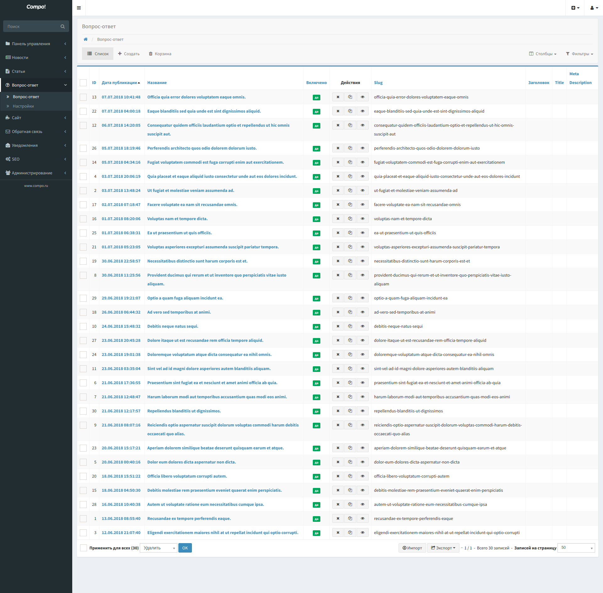
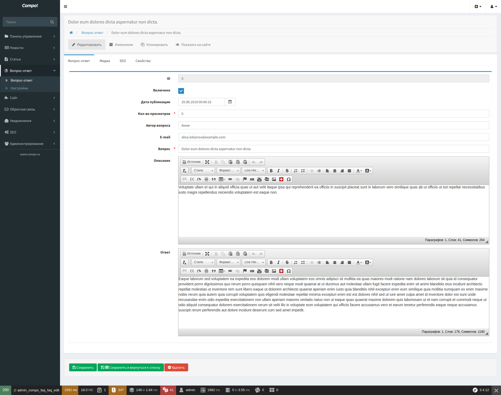
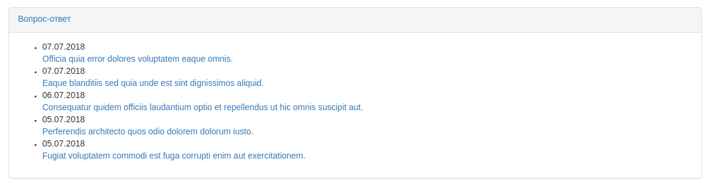

Faq - Вопрос-ответ
===================

Модуль "Вопрос-ответ" предназначен для оказания консультативной поддержки и гибкого управления вопросами посетителей сайта.

Вопрос-ответ, имеет следующие поля:

* Включить/Выключить
* Название - Вопрос
* Описание
* Текст - Ответ
* Автор вопроса
* E-mail автора вопроса
* Кол-во просмотров
* Дата публикации
* Изображение
* Seo настройки

На сайте выводятся список вопросов с постраничной навигацией.

Отображаются только включённые вопросы и с датой публикации меньше текущей даты.

Имеется блок, для отображения последних опубликованных вопросов.

Панель управления
-------------------

* Список

По умолчанию отсортировано по дате публикации, по убыванию.

* Редактирование

Блоки
-------------------

.. code-block:: twig

    {{ sonata_block_render({
        'type': 'compo_faq.block.service.faq_last',
        'settings': {
            'limit': 5
            'template': 'CompoFaqBundle:Block:faq_last.html.twig'
        }
    }) }}

Permalink
-------------------

#TODO

Controller
-------------------

.. code-block:: yaml

    compo_faq_index:
        path:     /faq/
        defaults: { _controller: "CompoFaqBundle:Faq:index" }
        methods:  GET

    compo_faq_show_by_slug:
        path:     /faq/{slug}.html
        defaults: { _controller: "CompoFaqBundle:Faq:showBySlug" }
        methods:  GET

AdminNavBar
-------------------

При просмотре на сайте, доступна панель администратора, для быстрого доступа к редактированию.

Breadcrumb
-------------------

Генерация хлебных крошек из вопроса.

Settings
-------------------

Кол-во вопросов на страницу при постраничной навигации на сайте.

Sitemaps
-------------------

Генерация Sitemaps со списком вопросов раз в сутки.

Templates
-------------------

* Faq/index.html.twig
* Faq/show.html.twig
* Block/faq_last.html.twig

.. code-block:: yaml

    sonata_block:
        blocks:
            compo_faq.block.service.faq_last:
                cache: sonata.cache.memcached
                contexts: [sonata_page_bundle]
                templates:
                    - { name: 'faq.template.faq.custom', template: 'CompoFaqBundle:Block:faq_last_custom.html.twig' }

Seo
-------------------

* URL
* Заголовок
* Title
* Description
* Keywords
