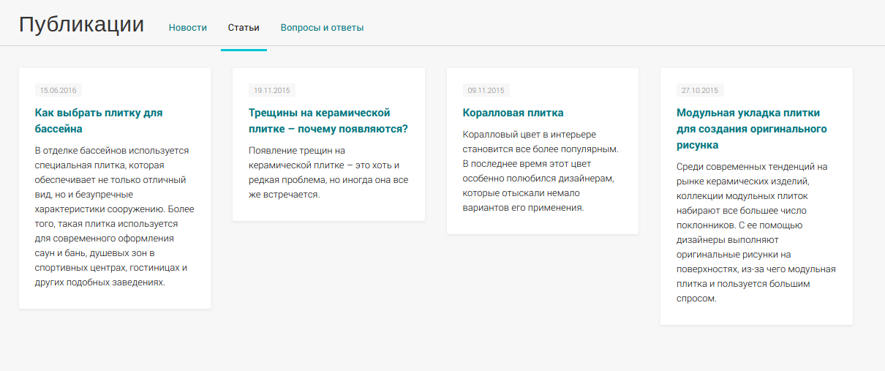

News
=================

Элемент списка преимуществ, имеет следующие поля:

* Включить/Выключить
* Название
* Описание
* Текст
* Кол-во просмотров
* Дата публикации
* Изображение
* Seo настройки

На сайте выводятся список статей с постраничной навигацией.
Отображаются только включённые статьи и с датой публикации меньше текущей даты.

Install
-------------------

* Add CompoArticlesBundle to your AppKernel:

.. code-block:: php

    <?php

    // app/AppKernel.php

    // ...
    public function registerBundles()
    {
        return array(
            // ...
            new \Compo\ArticlesBundle\CompoArticlesBundle(),
            // ...
        );
    }

* Add compo_articles.admin.articles to sonata_admin:

.. code-block:: yaml

    sonata_admin:
        dashboard:
            groups:
                sonata.admin.group.site_builder:
                    label:           site
                    label_catalogue: CompoCoreBundle
                    icon:            '<i class="fa fa-puzzle-piece"></i>'
                    items:
                        - compo_articles.admin.articles

* Add CompoArticlesBundle routes to your application routing.yml:

.. code-block:: yaml

    # app/config/routing.yml

    articles:
        resource: '@CompoArticlesBundle/Resources/config/routing.yml'
        prefix: /articles

* Update database schema by running command ``php app/console doctrine:schema:update --force``

Admin
-------------------

* List

По умолчанию отсортировано по дате публикации, по убыванию.

.. figure:: ../images/articles/list.png
    :align: center

* Edit

.. figure:: ../images/articles/edit.png
    :align: center

Block
-------------------

.. code-block:: twig

    {{ sonata_block_render({
        'type': 'compo_articles.block.service.articles_last',
        'settings': {
            'limit': 5
        }
    }) }}

Permalink
-------------------

#TODO

Controller
-------------------

.. code-block:: yaml

    compo_articles_index:
        path:     /articles/
        defaults: { _controller: "CompoArticlesBundle:Articles:index" }
        methods:  GET

    compo_articles_show_by_slug:
        path:     /articles/{slug}.html
        defaults: { _controller: "CompoArticlesBundle:Articles:showBySlug" }
        methods:  GET

AdminNavBar
-------------------

При просмотре на сайте списка статей или статьи, доступна панель администратора, для быстрого доступа к редактированию.

Breadcrumb
-------------------

Генерация хлебных крошек из названия статьи.

Settings
-------------------

Кол-во статей на страницу при постраничной навигации на сайте.

Sitemaps
-------------------

Генерация Sitemaps со списком статей раз в сутки.

Templates
-------------------

* Articles/index.html.twig
* Articles/show.html.twig
* Block/articles_last.html.twig

Seo
-------------------

* URL
* Заголовок
* Title
* Description
* Keywords

