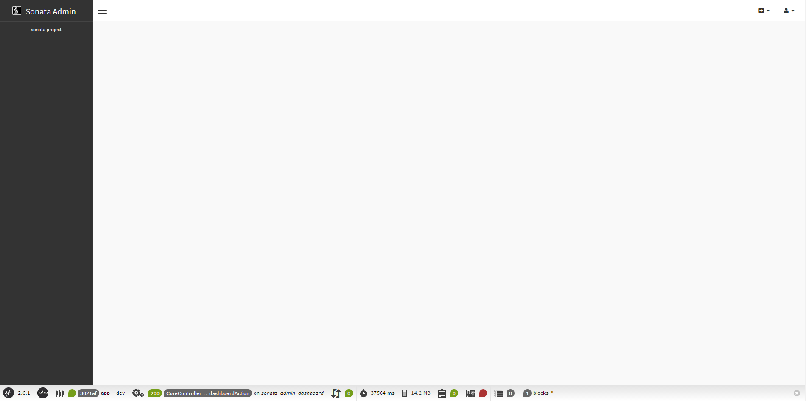

Installation
============

CompoCoreBundle is just a bundle and as such, you can install it at any
moment during a project's lifecycle.

Download the Bundle
-------------------

Open a command console, enter your project directory and execute the
following command to download the latest stable version of this bundle:

.. code-block:: bash

    $ composer require sonata-project/admin-bundle

This command requires you to have Composer installed globally, as explained in
the `installation chapter`_ of the Composer documentation.

Enable the Bundle
-----------------

Then, enable the bundle and the bundles it relies on by adding the following
line in `bundles.php` file of your project:

.. code-block:: php

    <?php

    // config/bundles.php

    return [
        //...
        Symfony\Bundle\SecurityBundle\SecurityBundle::class => ['all' => true],
        Sonata\CoreBundle\SonataCoreBundle::class => ['all' => true],
        Sonata\BlockBundle\SonataBlockBundle::class => ['all' => true],
        Knp\Bundle\MenuBundle\KnpMenuBundle::class => ['all' => true],
        Sonata\AdminBundle\SonataAdminBundle::class => ['all' => true],
        Compo\CoreBundle\CompoCoreBundle::class => ['all' => true],
    ];

.. note::
    If you are not using Symfony Flex, you should enable bundles in your
    ``AppKernel.php``.

.. code-block:: php

    // app/AppKernel.php

    // ...
    class AppKernel extends Kernel
    {
        public function registerBundles()
        {
            $bundles = [
                // ...

                // The admin requires some twig functions defined in the security
                // bundle, like is_granted. Register this bundle if it wasn't the case
                // already.
                new Symfony\Bundle\SecurityBundle\SecurityBundle(),

                // These are the other bundles the SonataAdminBundle relies on
                new Sonata\CoreBundle\SonataCoreBundle(),
                new Sonata\BlockBundle\SonataBlockBundle(),
                new Knp\Bundle\MenuBundle\KnpMenuBundle(),

                // And finally
                new Sonata\AdminBundle\SonataAdminBundle(),
                new Compo\CoreBundle\CompoCoreBundle(),
            ];

            // ...
        }

        // ...
    }

.. note::
    If a bundle is already registered, you should not register it again.

Preparing your Environment
--------------------------

As with all bundles you install, it's a good practice to clear the cache and
install the assets:

.. code-block:: bash

    $ bin/console cache:clear
    $ bin/console assets:install

The Admin Interface
-------------------

You've finished the installation process, congratulations. If you fire up the
server, you can now visit the admin page on http://localhost:8000/admin

.. note::
    This tutorial assumes you are using the build-in server using the
    ``bin/console server:start`` (or ``server:run``) command.

.. _`installation chapter`: https://getcomposer.org/doc/00-intro.md

